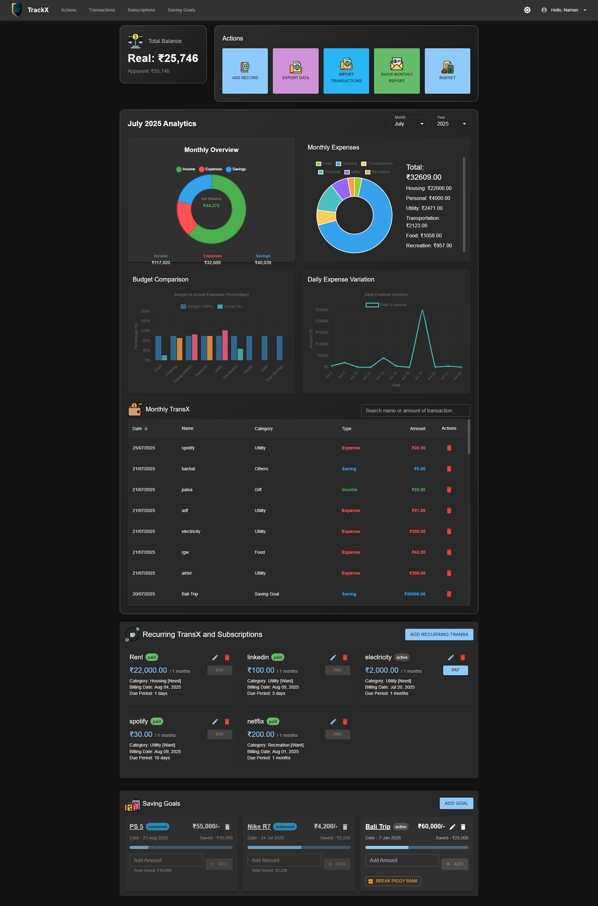

# TrackX - a personal financial analysis app 

## Tech Stack
This expense tracker app uses python (FastAPI and SQLite) backend, React (Vite, written in typescript) frontend and SQLite as Database.

## Dashboard Screenshot


## File Structure
1. all the backend files exist in the same directory
2. All the frontend files exist in the expense-tracker-frontend directory
3. main.py contains all the API and there function implementation
4. All the UI components are in expense-tracker-frontend\src\components
5. all the api call from frontend are written in expense-tracker-frontend\src\services\api.ts

## Features (Tentative | Keeps updating)
1. Add and delete expenses
2. Add, edit and delete subscriptions (recurring expense)
3. UI focuses on showing one month data (latest by default) and lets user select the month and year
4. Visualisation charts
5. Set and edit monthly budget for each category, income and savings goal
6. View expense list with sorting and search
7. Export all expense data in Excel format
8. Auto-category prediction from the expense name while adding the expense
9. Switch the UI to light and dark theme
10. Import and extract data from bank statements
11. Monthly report automated mail with analysis and chart visuals
12. Saving Goals to help you fly to your favourite foreign trip
13. View Balance amount as real (eventual) and apparent (currently in account) 

## Visualisation Charts
1. category-based expense pie-chart
2. category-based budget vs actual expenses column-graph
3. expense intention breakdown (need,want and savings) pie-chart
4. Daily expense variation line graph

## File Structure
1. all the backend files exist in the same directory
2. All the frontend files exist in the expense-tracker-frontend directory
3. main.py contains all the API and there function implementation
4. The service folder contains helper functions for main APIs 
5. All the UI components are in expense-tracker-frontend\src\components
6. all the api call from frontend are written in expense-tracker-frontend\src\services\api.ts

## Frontend Setup
1. Install dependencies
```bash
npm install
```
2. To build and start the server
Dev environement
```bash
npm run dev
```

Production environemnt
```bash
npm run build
```

## Backend Setup
1. Create a virtual environment:
```bash
python -m venv venv
```

2. Activate the virtual environment:
- Windows:
```bash
.\venv\Scripts\activate
```
- Unix/MacOS:
```bash
source venv/bin/activate
```

3. Install dependencies:
```bash
pip install -r requirements.txt
```

4. Run the application:
```bash
uvicorn main:app --reload
```

The API will be available at `http://localhost:8000`

## API Documentation

Once the server is running, you can access the interactive API documentation at:
- Swagger UI: `http://localhost:8000/docs`
- ReDoc: `http://localhost:8000/redoc` 
